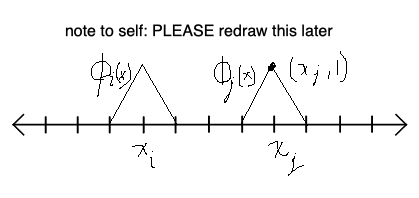

# 08 Finite element method

$$
\newcommand{\x}{\mathbf x}
\newcommand{\y}{\mathbf y}
\newcommand{\f}{\mathbf f}
\newcommand{\j}{\mathbf j}
\newcommand{\n}{\mathbf n}
\newcommand{\v}{\mathbf v}
\newcommand{\U}{\mathbf U}
\newcommand{\abs}[1]{\left\lvert #1 \right\rvert}
\newcommand{\norm}[1]{\big\lVert #1 \big\rVert}
\newcommand{\parens}[1]{\left( #1 \right)}
\newcommand{\brackets}[1]{\left[ #1 \right]}
\newcommand{\angles}[1]{\left\langle #1 \right\rangle}
\newcommand{\curlies}[1]{\left\lbrace #1 \right\rbrace}
\newcommand{\inv}[1]{#1^{-1}}
\newcommand{\d}{\, \text{d}}
\newcommand{\dbyd}[2]{\frac{\d #1}{\d #2}}
\newcommand{\partials}[2]{\frac{\partial #1}{\partial #2}}
\newcommand{\BigO}{\mathcal O}
\newcommand{\disclapl}[1][]{\partial_{#1} \overline \partial_{#1}}
\newcommand{\Domain}{\overline \Omega}
$$

## Finite differences vs finite elements

The finite difference method (FD) discretizes a boundary value problem, while the finite element method (FEM) discretizes the weak formulation of the boundary value problem.

Using the notation

$$
a(u, v) = \int_\Omega u' v' \d x \\
F(v) = \int_\Omega f v \d x
$$

The weak formulation of a BPV is

$$
\text{find } u \in V \text{ so that } a(u, v) = F(v) \text{ for all } v \in V
$$

Remember that $a, F, V$ all depend on the PDE that we are solving.

### Example

Consider the boundary value problem

$$
\begin{cases}
-u'' + u = f &\text{in } \Omega = (0, 1) \\
u'(0) = u'(1) = 0
\end{cases}
$$

Its weak formulation would be to find $u \in V$ so that $a(u, v) = F(v)$ for all $v \in V$, where

$$
V = \curlies{ v \in L^2(\Omega) : v' \in L^2(\Omega)} \\
a(u, v) = \int_\Omega (u'v' + uv) \d x \\
F(v) = \int_\Omega fv \d x
$$

## First step toward FEM

First, find the weak formulation of the BVP - define $V$, $a$, $F$ so that problem becomes

>  Find $u \in V$ so that $a(u, v) = F(v)$ for all $v \in V$

Let $S \subseteq V$ be any finite dimensional subspace. In our weak formulation, replace $V$ with $S$, so that our problem becomes

> Find $u_S \in S$ so that $a(u_s, v) = F(v)$ for all $v \in V$

Since $S$ is a subspace of $V$, $u_S$ is an approximation to $u \in V$.

### Questions about this first step

1. What can we say about the error between $u_S$ and $u$?
2. Can we prove convergence?
3. Are the weak form and its finite dimensional approximation well-posed? (i.e., do they even have a unique solution?)

## Error estimates

### Orthogonality

We define $u_S \in S$ as the function that solves

$$
a(u_S, v) = F(v) \text{ for all } v \in S
$$

Our original weakly formulated problem is to find $u \in V$ so that

$$
a(u, v) = F(v) \text{ for all } v \in V
$$
Since $S \subseteq V$, we know that $u$ solves the problem for all $v \in S$.

Subtracting our two equations, we find that for all $v \in S$ we have

$$
\begin{align*}
a(u, v) - a(u_S, v) &= F(v) - F(v) \\
a(u - u_S, v) &= 0
\end{align*}
$$

We know from functional analysis that $a$ defines an inner product, so the equation above states that $u - u_S$ is orthogonal to all $v \in S$ using the inner product $a(\cdot, \cdot)$

### Energy norm

The inner product $a(\cdot, \cdot)$ induces the **energy norm** on $V$:

$$
\norm{v}_E = \sqrt{a(v, v)}
$$

This norm satisfies all the expected inequalities, such as

- Cauchy-Schwarz inequality: $\abs{a(v, w)} \leq \norm{v}_E \norm{w}_E$​

### Error bound

So for any $v \in S$, we have

$$
\begin{align*}
\norm{u - u_S}^2_E &= a(u - u_S, u - u_S) \\
&= a(u - u_S, u - v + v - u_S) \\
&= a(u - u_S, u - v) + a(u - u_S, v - u_S)
\end{align*}
$$

Since $u - u_S$ is orthogonal to all functions in $S$, and $v - u_S \in S$, the last term is 0:

$$
\begin{align*}
\norm{u - u_S}^2_E &= a(u - u_S, u - v) + 0 \\
\norm{u - u_S}^2_E &\leq \norm{u - u_S}_E \norm{u - v}_E \tag{Cauchy-Schwarz} \\
\norm{u - u_S}_E &\leq \norm{u - v}_E
\end{align*}
$$

Since this holds for all $v \in S$, this shows that

$$
\norm{u - u_S}_E \leq \inf_{v \in S} \norm{u - v}_E
$$

However, $u_S$ itself is in $S$, so

$$
\norm{u - u_S}_E \leq \inf_{v \in S} \norm{u - v}_E \leq \norm{u - u_S} \\
\text{so } \norm{u - u_S}_E = \inf_{v \in S} \norm{u - v}_E
$$

Since we are attaining the infimum, we are free to rewrite this as a minimum:

$$
\norm{u - u_S}_E = \min_{v \in S} \norm{u - v}_E
$$

This means that $u_S$ is the function in $S$ that minimizes the energy norm $\norm \cdot _E$.

### $L^2$ norm

In practice, we want to quantify our error in the $L^2$ norm, not the $E$ norm:

With $L^2(\Omega) = \curlies{ v : \Omega \to \R : \int_\Omega v^2 < \infty}$

We can define an inner product on this space:

$$
\angles{u, v} = \int_\Omega uv \d x
$$

And this inner product induces a norm

$$
\norm{v} = \sqrt{\angles{v, v}} = \sqrt{\int_\Omega v^2 \d x}
$$

### Error estimate for $L^2$ norm

We will use a duality argument:

#### Example:

Consider the BVP:

$$
\begin{cases}
-u'' = f &\text{in } \Omega = (0, 1) \\
u'(0) = u'(1) = 0
\end{cases}
$$

Let's replace $f$ with $u - u_S$ and define $w$ to be the solution of the new problem:

$$
\begin{cases}
-w'' = u - u_S &\text{in } \Omega = (0, 1) \\
w(0) = w'(1) = 0
\end{cases}
$$

Then,

$$
\begin{align*}
\norm{u - u_S}^2 &= \angles{u - u_S, u - u_S} \\
&= \angles{u - u_S, -w''} \\
&= \int_0^1 (u - u_S)(-w'') \d x \\
&= \int_0^1 w' (u - u_S)' - w'(u - u_S) \Bigg\vert_0^1 \tag{integration by parts}
\end{align*}
$$

Since $w'(1) = 0$, and $u(0) = u'(0) = 0$, the constant term in this summation is $0$. So continuing,

$$
\begin{align*}
\norm{u - u_S}^2 &= \int_0^1 w' (u - u_S)' 0 \\
&= a(u - u_S, w) \\
&= a(u - u_S, w) - a(u - u_S, v) \text{ for any } v \in S \tag{orthogonality} \\
&= a(u - u_S, w - v) \\
\norm{u - u_S}^2 &\leq \norm{u - u_S}_E \norm{w - v}_E \\
\norm{u - u_S} &\leq \norm{u - u_S}_E \frac{\norm{w - v}_E}{\norm{u - u_S}} \tag{Cauchy-Schwarz} \\
&= \norm{u - u_S}_E \frac{\norm{w - v}_E}{\norm{w''}} \tag{$u - u_S = -w''$}
\end{align*}
$$

Since this is true for all $v \in S$, it is true for the infimum:

$$
\norm{u - u_S} \leq \norm{u - u_S}_E \parens{ \inf_{v \in S} \frac{\norm{w - v}_E}{\norm{w''}} }
$$

$\inf_v \norm{w - v}_E$ clearly depends on $S$, and we will see later that $w$ also depends only on $S$. Thus $\norm{u - u_S}$ can be bounded by $\norm{u - u_S}_E$ times a factor that depends on $S$.)

## Dealing with $S$

We can use any finite-dimensional space of functions we want, but for FEM we will focus on piecewise-linear polynomials.

Introduce a grid $0 = x_0, x_1, \cdots, x_{n-1}, x_n = 1$

Let $S$ be the space of functions $v$ where:

1. $v \in C^0([0, 1])$ - $v$ is continuous
2. $v\Bigg \vert_{[x_{i-1}, x_i]}$ (aka $v(x)$ restricted to the interval $[x_{i-1}, x_i]$) is a linear polynomial for each subinterval in the grid
3. $v(0) = 0$

It can be shown that $S$ is a subspace of $V$​.

### Hat functions

Define $\phi_i$ as a hat function:

$$
\phi_i(x) =
\begin{cases}
\displaystyle \frac{x - x_{i-1}}{x_i - x_{i-1}} & x_{i-1} \leq x \leq x_i \\
\displaystyle \frac{x_{i + 1} - x}{x_i - x_{i-1}} & x_i \leq x \leq x_{i+1} \\
0 & \text{otherwise}
\end{cases}
$$

This has a narrow support (it is nonzero on a very small patch), so in practice it gives us a lot of sparsity.

### Terminology

- the grid is a **mesh**
- $\curlies{ x_i}$ in our mesh are **nodes**
- the set of values of a function $v$ at the nodes, $\curlies{ v(x_i)}$ are **nodal values** of $v$​
- our hat functions $\curlies{ \phi_i}$ are a **nodal basis** for $S$

### Interpolant

Given any $v \in C^{\infty}([0, 1])$, the **interpolant** $v_I \in S$ of $v$ is defined as $\displaystyle \sum_{i=1}^n v(x_i) \phi_i(x)$ - this is our piecewise linear approximation to $v$. It can be constructed for any such $v$.

This isn't necessarily the best approximation to $v$, but it is *an* approximation, so its error would give us an upper bound on the error in the finite element method (which *would* find the best approximation).

It is possible to quantify the error between a function $u$ and its interpolant without knowing $u$! And thus to upper bound the error on $u_S$ without knowing $u$.
